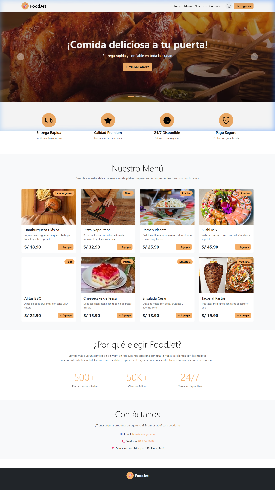
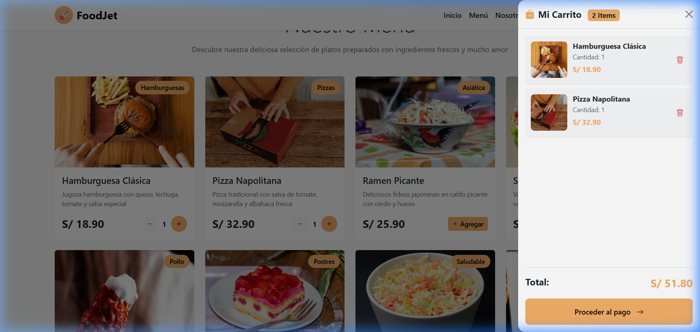
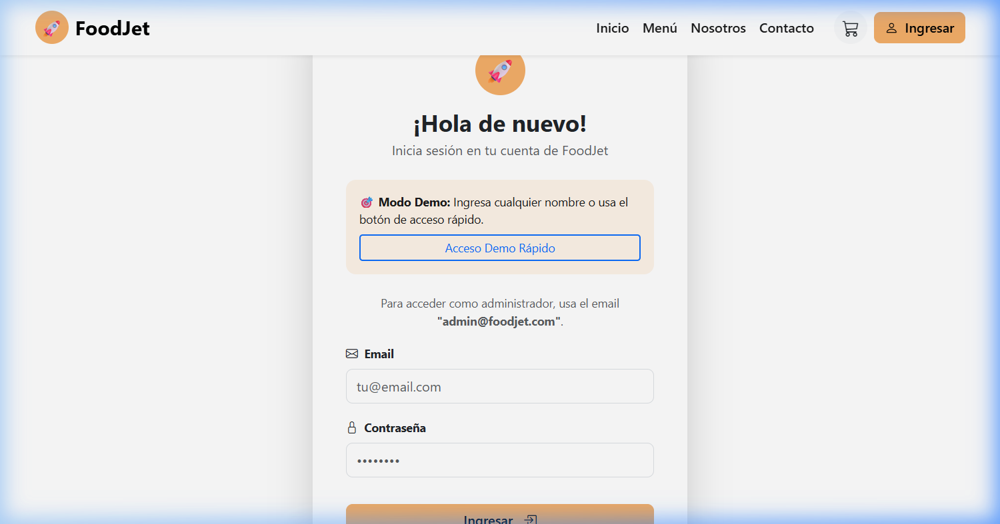
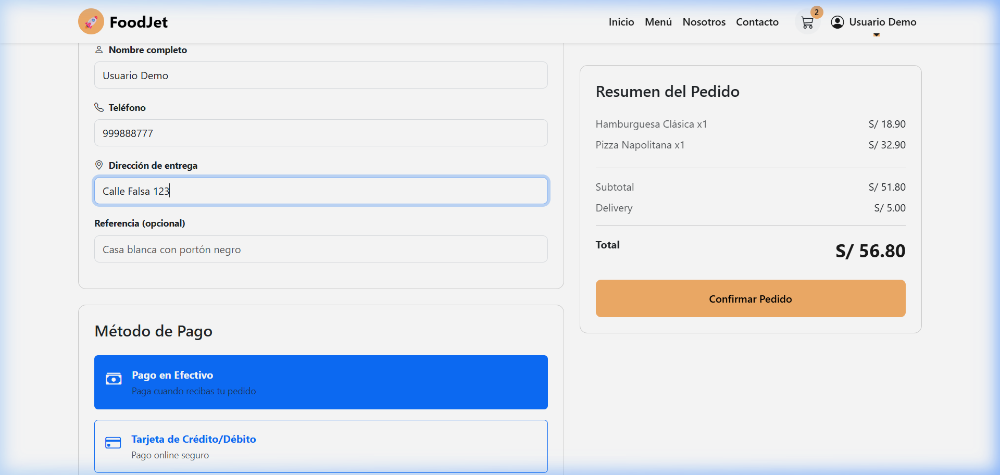
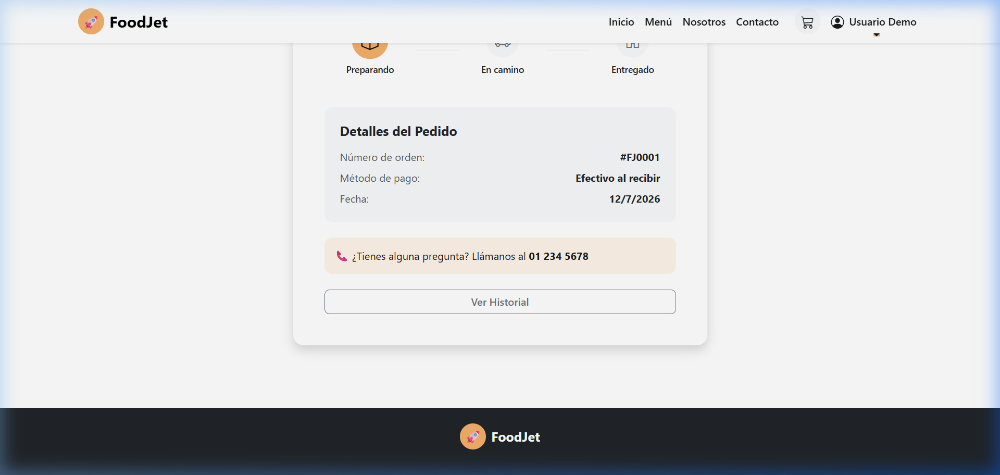
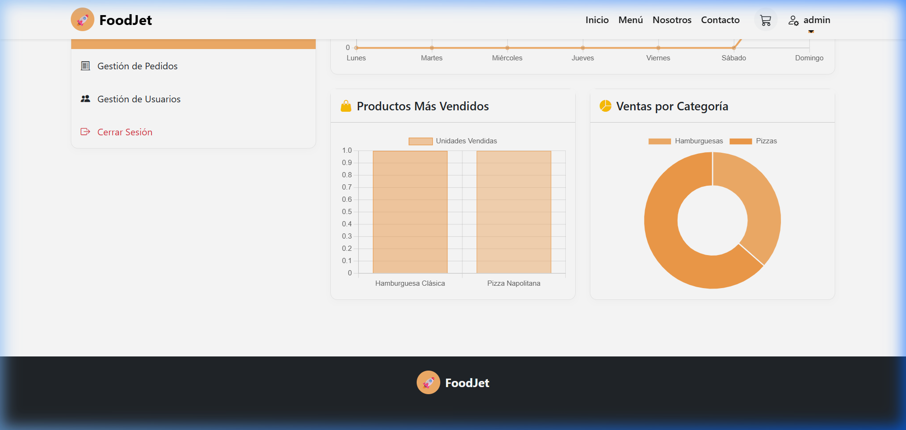

# 🚀 FoodJet - Sistema de Entrega de Comida a Domicilio

**FoodJet** es una plataforma moderna y responsiva de delivery/entrega de comida a domicilio. El sistema se compone de una arquitectura desacoplada que incluye un backend robusto en **Spring Boot** (con seguridad avanzada JWT y base de datos MySQL) y un frontend dinámico desarrollado en **Angular 21** (utilizando Signals para la gestión reactiva del estado y Bootstrap para un diseño limpio y moderno).

---

## 📸 Capturas del Frontend

A continuación se muestran capturas de pantalla de las principales vistas de la aplicación:

### 1. Página de Inicio y Menú de Productos (`Home`)
Vista principal donde los usuarios pueden explorar los platos organizados por categorías, filtrar y agregarlos directamente al carrito de compras de manera interactiva.


### 2. Carrito de Compras Lateral (`Cart`)
Panel lateral desglosable (Offcanvas) que lista los artículos agregados, calcula dinámicamente el subtotal, costo de envío fijo y total, y permite modificar cantidades o proceder al pago.


### 3. Formulario de Inicio de Sesión (`Login`)
Formulario con validaciones completas para el ingreso de clientes y administradores con seguridad JWT.


### 4. Formulario de Pago (`Checkout`)
Proceso de pago donde el cliente ingresa su nombre, teléfono, dirección de entrega exacta, referencias adicionales y selecciona su método de pago preferido.


### 5. Seguimiento del Pedido (`Order Tracking`)
Pantalla en tiempo real donde el cliente puede seguir el estado actual de su pedido (Registrado, En Preparación, En Camino, Entregado) mediante una barra de progreso visual.


### 6. Panel del Administrador (`Admin Dashboard`)
Panel exclusivo para administradores que incluye gráficos interactivos de ventas mensuales, estadísticas de usuarios y pedidos, además de un listado detallado para actualizar los estados de los pedidos de forma dinámica.


---

## 🛠️ Tecnologías y Arquitectura

### Backend (Carpeta `/backend`)
*   **Lenguaje / Framework:** Java 17+ con Spring Boot 4.1.0
*   **Seguridad:** Spring Security con soporte para **JSON Web Tokens (JWT)** para autenticación segura y autorización basada en roles (`admin` y `customer`).
*   **Persistencia:** Spring Data JPA con Hibernate.
*   **Base de Datos:** MySQL 8.x.
*   **Utilidades:** Lombok para reducción de código repetitivo y Validation API para validación de datos en controladores.

### Frontend (Carpeta `/foodjet-angular`)
*   **Framework:** Angular 21 (Componentes Autónomos / Standalone).
*   **Gestión de Estado:** Angular **Signals** y propiedades computadas (`computed`) para reactividad de alto rendimiento en el carrito y autenticación.
*   **Diseño y Estilos:** Bootstrap 5 con Bootstrap Icons para componentes responsivos y fluidos.
*   **Visualización:** Chart.js para renderizar los gráficos de ventas y pedidos en el panel de administración.

---

## 📁 Estructura del Repositorio

```text
├── backend/                  # Código fuente del servidor (Spring Boot)
├── foodjet-angular/          # Código fuente del cliente (Angular 21)
├── docs/
│   └── screenshots/          # Capturas de pantalla de la interfaz de usuario
├── script_database.sql       # Script de creación de tablas en la base de datos
├── script_data.sql           # Script de inserción de productos y usuarios iniciales
└── README.md                 # Documentación principal del proyecto (este archivo)
```

---

## 🚀 Instrucciones de Configuración y Ejecución

### 1. Base de Datos (MySQL)

Asegúrate de tener un servidor MySQL en funcionamiento en el puerto `3306`. 

1. Abre tu terminal o cliente de MySQL (MySQL Workbench, DBeaver o phpMyAdmin) y ejecuta el contenido del script de base de datos para crear la estructura:
   ```sql
   SOURCE script_database.sql;
   ```
2. Ejecuta el script de datos iniciales para cargar platos por defecto y cuentas de usuario:
   ```sql
   SOURCE script_data.sql;
   ```

*Nota: La configuración por defecto del backend asume que tu usuario de base de datos es `root` y la contraseña es `1234`. Si necesitas modificar esto, edita el archivo:*
📄 [application.properties](file:///c:/Users/User/Downloads/Pagina%20Foodjet/backend/src/main/resources/application.properties)

---

### 2. Ejecutar el Backend (Spring Boot)

El proyecto incluye el Maven Wrapper (`mvnw`), por lo que no es necesario tener Maven instalado de forma global.

Desde la raíz del proyecto, ejecuta:
```bash
cd backend
.\mvnw.cmd spring-boot:run
```
*(En sistemas basados en Unix/Linux, usa `./mvnw spring-boot:run`)*

El backend iniciará en el puerto **`8080`** (`http://localhost:8080`).

---

### 3. Ejecutar el Frontend (Angular)

Asegúrate de tener **Node.js** (versión 18 o superior) instalado.

Desde la raíz del proyecto, ejecuta:
```bash
cd foodjet-angular
npm install
npm start
```

El servidor de desarrollo iniciará y la aplicación estará disponible en tu navegador en:
🔗 **`http://localhost:4200`**

---

## 🔑 Credenciales de Acceso para Pruebas

Para explorar todas las funcionalidades de la aplicación, puedes utilizar las siguientes cuentas creadas en el script de datos por defecto:

### Perfil Cliente (Customer)
*   **Correo:** `demo@foodjet.com`
*   **Contraseña:** `demo123`
*(Permite realizar compras, agregar al carrito, registrar datos de envío y ver el tracking del pedido)*

### Perfil Administrador (Admin)
*   **Correo:** `admin@foodjet.com`
*   **Contraseña:** `admin123`
*(Permite ingresar al panel de control, ver estadísticas generales y actualizar el estado de los pedidos de los clientes)*
